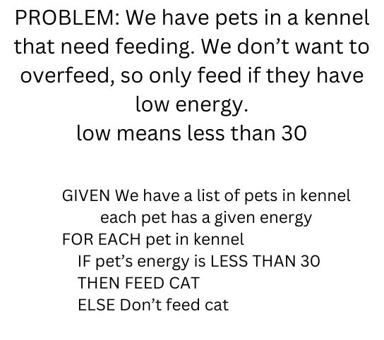
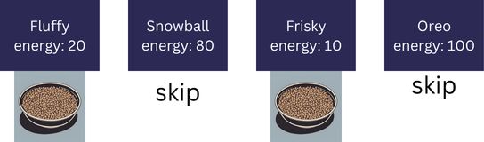

# Week 3

## Day 1

- Questions about last week's work
- Discuss strategies
- Dev Tools vs Node environment

- JavaScript Object Review
- What is `this`

## Day 2

- Reading
  - Question 2: In what scenarios would you need to use bracket notation instead of dot notation to access a property in an object? Provide an example.
    - Answer: You would need to use bracket notation if the property name is unusual for some reason. For example:
    - cat["name"] is OK to use with dot notation.
    - cat["last name"] is not because it contains a space.
  - Question 4: How does the behavior of the this keyword differ when used in a function inside the global context compared to when it's used inside an object method?
    - Answer: In a method, `this` refers to the object.
    - In a function, `this` is the "global context".

## Review for the week

- Day 1: Creating Objects (one by one, manually)
    let pet = {
      name: "Fluffy",
      species: "cat",
      feed: function () {
          console.log("You feed " + this.name);
      }
    }
- Day 2: Factory Functions (Creating objects)
    // Step 1: pass arguments
    // Step 2: create new object 
    // Step 3: return the object
    function createPet(n, species, age) {
      let p = {
        name: n,
        species: species,
        age: age
      }
      return p;
    }
- Day 3: Objects in an array (people in a house, pets in a kennel)
    let kennel = [];
    let p1 = createPet("Fluffy", "Cat", 5);
    kennel.push(p1);
    kennel.push(createPet("Snowball", "Cat", 2));
    kennel[2] = createPet("Frisky", "Cat", 4);
- Day 4: for loops
    // FEED EACH PET in KENNEL
    // LET KENNEL be the list of pets
    // GIVEN each pet has a feed method

    // FOR EACH p in the KENNEL
    //   feed the pet
    for(let i=0; i<kennel.length; i++) {
      kennel[i].feed();
    }

    // DO NOT WANT: kennel[100]  if we only have 5 cats, for example
- Day 5: conditionally feed our cat (Or have birthday party)
    // GIVEN a list of cats in a KENNEL
    // feed each cat, but only if the cat is hungry
    
    // FEED EACH PET in KENNEL
    // LET KENNEL be the list of pets
    // GIVEN each pet has a feed method

    // FOR EACH p in the KENNEL
    //   ??? 

## Birthday Example

    let kid1 = {
      name: "Alice",
      age: 7,
      allowedToHaveSugar: false,
      haveAParty() {
        console.log(`${this.name} brought cake to school for a party.`);
      }
    }
    let kid2 = {
      name: "Bob",
      age: 7,
      allowedToHaveSugar: true,
      haveAParty: function() {
        console.log(`${this.name} brought cake to school for a party.`);
      }
    }
    let firstGrade = [];
    firstGrade.push(kid1)
    firstGrade.push(kid2)

    // BIRTHDAY EXAMPLE
    // thing to keep in mind: which do we skip in the for loop?

    // GIVEN a list of kids in firstGrade
    // FOR EACH kid in firstGrade
    //   IF the kid can have sugar
    //   THEN have a birthday party
    for(let i=0; i<firstGrade.length; i++) {
      if(firstGrade[i].allowedToHaveSugar === true) {
        firstGrade[i].haveAParty();
      }
    }

#### Example of inequality conditional

    if(item.cost < 100){
      buy(item);
    }
